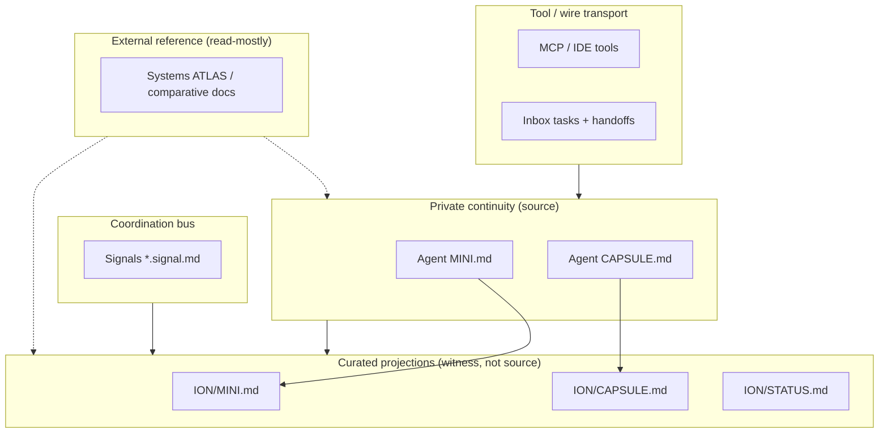

# ION context planes (diagram + forbidden merges)

**Purpose:** Name the **distinct surfaces** that people call “context” so they are not collapsed into one bucket. This aligns with **private continuity vs projection** in `CONTINUITY_ARCHITECTURE.md` and with the **field + AIM-OS lineage** map in `ATLAS/comparative/context_systems_landscape.md`.

**Authority:** Architectural vocabulary for ION; **not** a runtime compiler spec.

---

## 1. Plane diagram (conceptual)

**Read the arrows loosely:** private state **feeds** projections (manually or via a future compiler); tools and signals **touch** agents and projections; ATLAS **informs** design work but does **not** replace private continuity.

---

## 2. Plane table

| Plane | Typical paths | Who writes | Role |
|-------|---------------|------------|------|
| **Private routing** | `ION/agents/{role}/MINI.md` | That agent only | Session routing, lane state |
| **Private work log** | `ION/agents/{role}/CAPSULE.md` | That agent only | Evidence-grade private history |
| **Root projection** | `ION/MINI.md`, `ION/CAPSULE.md`, `ION/STATUS.md` | Vizier / operator curation (today) | Sovereign-facing witness surface |
| **Tool transport** | MCP, Cursor tasks, CLI | Tool hosts + agents | Capabilities and payloads across boundaries |
| **Coordination bus** | `ION/05_context/signals/`, inbox, handoffs | Per protocol | Async cross-agent messages |
| **Field reference** | `ATLAS/`, comparative markdown | Atlas + curators | External systems and lineage vocabulary |

---

## 3. Forbidden merges

| Wrong move | Why it fails |
|------------|--------------|
| Treating **root `ION/CAPSULE.md`** as **every agent’s private log** | It is a **projection**; source continuity stays under `ION/agents/*/`. |
| Treating **MCP tool output** as **doctrine** | Transport + tools ≠ governance or continuity authority. |
| Collapsing **MCP**, **LSP**, and **DAP** into one undifferentiated “IDE context” | Three protocols, three capability surfaces (`model-context-protocol`, `language-server-protocol`, `debug-adapter-protocol` in ATLAS); see `ION_OVER_CURSOR_PROTOCOL.md` §1. |
| Treating **ATLAS** (or AIM-OS path summaries inside it) as **ION law** | Reference and lineage maps are **inputs to design**, not `A1_KERNEL` by themselves. |
| Treating **RAG / retrieval** as a **governed context package** without envelope + authority | Selection without tiering and writer rules is a different class of system (see ATLAS landscape doc). |
| Equating **roadmap DAGs** (PLAN.md) with **runtime execution graphs** | Same word, different semantics; name which graph you mean. |

---

## 4. Relation to AIM-OS patterns

AIM-OS discussed **Perfect \* standards**, **HHNI → “Optimal Context”**, **JOC S0–S8 / Context Web / mesh maps**, and **SDF-CVF parity** as **separate** ideas. ION should **borrow patterns** only with explicit mapping to the planes above. Pointers: `ATLAS/comparative/context_systems_landscape.md` §8.

---

## 5. See also

- `ION/02_architecture/CONTINUITY_ARCHITECTURE.md` — law for private vs compiled projection.  
- `ATLAS/comparative/context_systems_landscape.md` — public + AIM-OS lineage comparative.  
- `ION/03_registry/boots/ATLAS.boot.md` — Atlas role boundaries.
