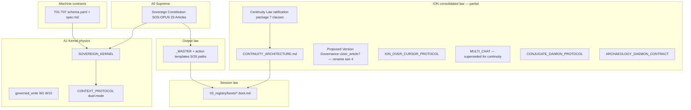

# End-to-End Governance Map (Laws, Protocols, Templates)

## 1. Why this document exists

Consolidation produced **many partial truths at once**: historical SOS doctrine, SOS-OPUS extensions, Gemini cognitive fields, new `ION/` kernel schemas, corrected **per-agent continuity**, proposed **version governance**, multi-model roles (Vice, Vestige), and an IDE/manual execution surface. None of those layers were authored as a single stack; they **must be reconciled deliberately** or agents will keep “winging it” against incompatible laws.

This map is the **inventory + gap list + reconciliation spine**. It does not replace ratification; it shows what must be merged, renamed, or patched after ratification.

---

## 2. Stack diagram (end-to-end)

---

## 3. Authoritative sources today (where truth lives)

| Layer | Canonical paths (current) | In unified `ION/`? | Notes |
|-------|---------------------------|--------------------|-------|
| Constitution | `SOS-OPUS/01_doctrine/SOVEREIGN_CONSTITUTION.md` (also `SOS/`, `SOS-Gemini/`) | **No** — planned T16 → `ION/01_doctrine/` | v5.0.0 DRAFT; Article 23 = IDE Liaison |
| Kernel | `SOS-OPUS/01_doctrine/SOVEREIGN_KERNEL.md` | No (T16) | Operational physics |
| Context / dual-mode | `SOS/02_architecture/CONTEXT_PROTOCOL.md` | Referenced from continuity law evidence | Bridges daemon vs IDE |
| Template registry | `SOS-OPUS/07_templates/_MASTER.md` (+ `SOS/`, `SOS-Gemini/`, `ION-BUILD/context/templates/_MASTER.md`) | **No** — PLAN targets `ION/07_templates/` | PLAN notes extended FSM registration in T16 |
| Continuity law (corrected) | `ION/02_architecture/CONTINUITY_ARCHITECTURE.md` | Yes | ACTIVE; supersedes shared-surface coordination |
| Continuity clauses (roundtable) | `.../continuity_crisis/synthesis/2026-04-03_continuity_law_ratification_package.md` | Yes | Awaiting Sovereign Q1/Q2 |
| Version governance (proposal) | `ION/05_context/comms/roundtable/vizier_article7_version_governance.md` | Yes | PROPOSED; **naming collision** with Constitution Art. 7 |
| Kernel schemas | `ION/06_intelligence/specs/T0*.schema.yaml` | Yes | Doctrine-first; Python generated later |
| Authority resolutions | `ION/06_intelligence/decisions/T08-T14_authority_resolutions.md` | Yes | Competing roots resolved for merge direction |
| Agent boots | `ION/03_registry/boots/*.boot.md` | Yes | Must stay aligned with continuity + constitution |
| Protocol web | `ION/06_intelligence/research/2026-04-03_protocol_context_web_map.md` | Yes | 22 systems; use for dependency-aware patching |

---

## 4. Critical naming collision (must fix in doctrine pass)

**SOS-OPUS Constitution already defines:**

- **Article 7** — Template-First Axiom  
- **Article 8** — Pure Template State Machine  

The roundtable **continuity law** uses seven clauses (not numbered “Article 1–7” in the constitution sense). Vizier’s **proposed “Article 7 — Version Governance”** and **“Article 8 — Continuity-Sensitive Release”** in `vizier_article7_version_governance.md` **reuse the same numbers as constitutional Articles 7–8** with **different meaning**.

**Recommendation (for T16 / ratification housekeeping):**

- Treat roundtable continuity as **ION Continuity Law** with clauses **CL-1 … CL-8** (if version governance is ratified as an eighth clause), **or** keep Nemesis’s seven clauses and add version governance as **CL-8** without reusing “Article.”
- Reserve **“Article N”** for **SOVEREIGN_CONSTITUTION.md** only inside unified doctrine.
- Cross-reference in prose: “Constitution Article 7 (templates)” vs “Continuity Law CL-8 (version governance).”

Until renamed, any agent reading “Article 7” may apply the **wrong law**.

---

## 5. Ideals introduced during consolidation (must propagate)

These are **new or sharpened** relative to older SOS-only doctrine:

| Ideal | Implication for laws/protocols/templates |
|-------|-------------------------------------------|
| Per-agent private MINI/CAPSULE | Constitution Art. 23 still says IDE liaison maintains MINI/CAPSULE — must explicitly mean **private paths** (`ION/agents/{role}/`), not root. |
| Projections ≠ source | Root `ION/MINI.md` etc. are **projections**; templates and boots must say so in ROUTING sections. |
| Version governance (git now, tool-independent later) | Templates should require **commit + signal** (or Scribe path) for governed work units; aligns with W9 provenance. |
| Conjugate Daimon + release chain | Continuity-sensitive release: Primary → Vice → Nemesis → Sovereign; templates for PLAN/SPEC/RELEASE must cite this where applicable. |
| Archaeology daemon (Vestige) | Surface-only; no doctrine edits — must not be conflated with Nemesis or Vice in templates/registry. |
| Chat-death test | Boot + MINI route lists are **mandatory acceptance**; template INVARIANTS should mention fresh-session resume. |

---

## 6. Known constitutional tension (IDE vs swarm model)

**Article 11** (agents ephemeral, no self-assembled context) describes **daemon/swarm** physics. **Article 23** describes **IDE Liaison** with filesystem read/write and MINI/CAPSULE. **Current reality** is IDE/manual consolidation.

**Reconciliation options** (for Sovereign / T16):

1. Add an explicit **execution mode preamble** to unified constitution: `MODE ∈ {DAEMON, IDE_MANUAL}` with article applicability table.  
2. Or amend Article 11 to scope it: “Under MODE=DAEMON, agents are ephemeral consumers…”  

Until then, agents should treat **Article 23 + Continuity Law + CONTINUITY_ARCHITECTURE** as the governing picture for Cursor work, and treat Article 11 as **forward-looking daemon law**, not a contradiction to ignore silently.

---

## 7. Template layer — what “go over everything” means practically

`_MASTER.md` already requires every template to include: **PREREQUISITES, SPEC, ROUTING, INVARIANTS** mapped toward **MINI/CAPSULE** and **W1–W10**.

**End-to-end pass (post-ratification, aligns with ratification package §5 step 4):**

1. **ROUTING** — Replace any instruction that updates “the” root CAPSULE with **private path** + optional projection note.  
2. **INVARIANTS** — Add chat-death check where outputs change governance or continuity.  
3. **Manual mode** — Where automation absent, state “operator must manually …” explicitly (Sovereign’s nutshell of ION).  
4. **FSM** — Extended template vocabulary (SPEC, CONSOLIDATION, EVIDENCE, etc.) must be registered in provisional constitution per PLAN T16 / Nemesis FSM note.  
5. **SSP** — Decide whether IDE agents emit full JSON SSP or a **documented markdown profile** (otherwise Cage doctrine is aspirational in Cursor).  

---

## 8. Reconciliation program (ordered)

Aligned with `ION/PLAN.md` and Nemesis recovery sequence:

| Step | Action | Owner |
|------|--------|-------|
| R0 | Ratify Continuity Law Q1/Q2; resolve **CL vs Constitution Article numbering** | Sovereign + roundtable |
| R1 | T16: provisionally assemble `ION/01_doctrine/` from SOS + OPUS + Gemini + **Continuity Law** + **Version governance (CL-8)** | Vizier + Scribe + Nemesis audit |
| R2 | Copy/register `ION/07_templates/` from chosen authority row; patch ROUTING for private continuity | Mason/Scribe + Nemesis |
| R3 | Patch boots once doctrine stable; re-run chat-death tests per role | All agents |
| R4 | T22+ implement kernel; T31 audit; T32 ratify PROVISIONAL → ACTIVE | Mason + Nemesis |

---

## 9. Relation to existing maps

- **Protocol Context Web (22 systems):** dependency and truth-state detail — use when editing any single protocol so side effects are visible.  
- **TRUE_CORES / TOTAL_ION_DIRECTION:** value hierarchy and “one loop” — use when prioritizing which laws must win in a conflict.  
- **T08–T14 decisions:** which root wins per subsystem when merging files.

---

## 10. Bottom line

You were right to ask for a **full pass**. The system is not one law; it is a **stack** with **two parallel numbering namespaces** about to collide, **dual execution physics** (daemon vs IDE), and **templates still rooted in pre-continuity-correction routing**. The honest state is: **inventory is clear; unification is a gated merge (T16 + template patch pass), not more ad-hoc files.**

Next governance action: **Sovereign ratification** plus **explicit rename** of continuity/version clauses to **CL-\*** (or another non-colliding scheme) before anything is filed as `ION/01_doctrine/SOVEREIGN_CONSTITUTION.md`.
