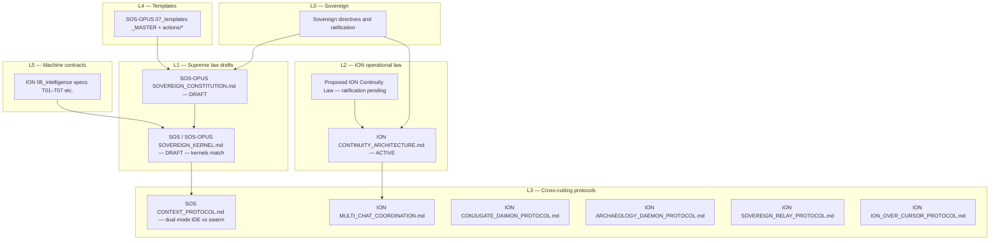

# End-to-End Law, Protocol, and Template Evolution Program

## 1. Why this exists

Continuity recovery and the proposed **ION Continuity Law** correct *where truth lives* (private per-role continuity vs curated projections). That fix does **not** automatically reconcile **supreme doctrine** (Constitution / Kernel), **legacy SOS specs**, **ION-specific protocols**, and the **template registry**. Without a single map and a staged harmonization program, the system can again *feel* aligned while **layered contradictions** remain — the same failure mode that produced the continuity crisis.

This document is the **inventory + contradiction register + phased program** so the Sovereign and team can evolve the whole picture deliberately, not accidentally.

---

## 2. Layered map (what governs what)

Think of governance as a **stack**. Lower layers constrain higher layers; higher layers may **specialize** but must not **silently contradict** unless marked `PROVISIONAL` / `STALE_COMPETITOR` with an explicit resolution path (per T06-style authority discipline).

**Reading order for “whole picture” audits**

1. Sovereign ratification packets (`ION/05_context/comms/sovereign/`, roundtable synthesis).
2. `ION/02_architecture/CONTINUITY_ARCHITECTURE.md` + proposed continuity law + role matrix.
3. `SOS-OPUS/01_doctrine/SOVEREIGN_CONSTITUTION.md` then `SOVEREIGN_KERNEL.md`.
4. `SOS/02_architecture/CONTEXT_PROTOCOL.md` (still authoritative for *concept* of dual modes; paths may be legacy).
5. All files under `ION/02_architecture/*.md` that apply to current team composition.
6. `SOS-OPUS/07_templates/_MASTER.md` then each action template touched by live workflows.
7. `ION/06_intelligence/specs/*.schema.yaml` for anything automation or compiler-bound.

---

## 3. Duplicate and fork risk (immediate hygiene)

| Artifact | Location A | Location B | Finding |
|----------|------------|------------|---------|
| `SOVEREIGN_KERNEL.md` | `SOS/01_doctrine/` | `SOS-OPUS/01_doctrine/` | **Identical** at time of this scan — good, but duplication still risks future drift. |
| `SOVEREIGN_CONSTITUTION.md` | `SOS/01_doctrine/` | `SOS-OPUS/01_doctrine/` | **Differs** — **one must be declared canonical** or merged; Nemesis treats divergent supreme law as **HIGH** severity. |

**Program item G0:** Sovereign (or Vizier with Sovereign sign-off) names **one canonical Constitution path** for edits; the other becomes a symlink, re-export, or explicit archive with `STALE_COMPETITOR` marking.

---

## 4. Contradiction and drift register (non-exhaustive but structural)

These are **architectural tensions**, not typos. Resolving them is the core of “evolve laws with current ideals.”

| ID | Topic | High-level tension | Where it shows up | Direction for harmonization |
|----|--------|-------------------|-------------------|----------------------------|
| D1 | Ephemeral agents vs IDE continuity | Kernel **K1/K2** and Constitution **Article 11** describe agents as **pure functions** that do **not** persist state; **Article 23** and real IDE practice require **durable MINI/CAPSULE** (now **per-role private** under ION law). | `SOVEREIGN_KERNEL.md`, `SOVEREIGN_CONSTITUTION.md` Art. 11 vs 23 | Split into **execution profiles**: `PROFILE_SWARM_EPHEMERAL` vs `PROFILE_IDE_LIAISON` vs `PROFILE_MULTI_CHAT_ROLE` with explicit state rights. Do not let one article pretend both are the same physics. |
| D2 | MINI/CAPSULE paths | `CONTEXT_PROTOCOL.md` still anchors IDE state at **`05_context/MINI.md`** style paths for SOS; ION law anchors **private** state at **`ION/agents/{role}/`** and root as **projection**. | `SOS/02_architecture/CONTEXT_PROTOCOL.md`, `ION/CONTINUITY_ARCHITECTURE.md` | Update CONTEXT_PROTOCOL (or add ION addendum file) so **paths and truth class** match ION; keep dual-mode *concept*. |
| D3 | SSP strictness | Constitution **Article 9** mandates JSON SSP for all output; IDE chats routinely produce markdown unless a cage enforces SSP. | `SOVEREIGN_CONSTITUTION.md` | Clarify **enforcement tier**: where SSP is **legally required** vs **recommended** vs **daemon-only**; align with Article 23 liaison reality. |
| D4 | Template routing vs private continuity | `UPDATE_CAPSULE` and similar templates still describe **direct** `CAPSULE.md` / `MINI.md` updates and compilers in a **single-tree** mental model. | `SOS-OPUS/07_templates/actions/UPDATE_CAPSULE.md` | Refactor template **ROUTING** sections to **role-relative paths** + “projection curator” rule for shared views. |
| D5 | Tier table vs live roles | Constitution **Article 2** tier table does not list **Vice (Daimon)**, **Vestige**, **Relay**, **Atlas**, **Codex liaison** as first-class rows. | `SOVEREIGN_CONSTITUTION.md` | Amendment or annex: **Governance roster** with tier/domain and write class (Inspector vs Architect vs Relay-only-private, etc.). |
| D6 | Release chain vs template graph | `MULTI_CHAT_COORDINATION.md` encodes **Vizier + Vice + Nemesis** release discipline; **Pure Template FSM** in Constitution lists a smaller node set. | Art. 8, `MULTI_CHAT_COORDINATION.md` | Either extend FSM nodes / governance gates in doctrine or explicitly state that **release review** is a **meta-transition** not a template node. |
| D7 | Protected paths | Article 16 lists protected trees relative to SOS layout; ION consolidation adds **`ION/06_intelligence/`**, **`ION/03_registry/`**, etc. | Art. 16 | Sovereign-approved **ION protected path annex** so enforcement and audits share one list. |

Vestige should **track** this table as living document; Nemesis should **audit** closure of each row.

---

## 5. Template registry: scope of review

`SOS-OPUS/07_templates/_MASTER.md` is the registry. A full evolution pass means **each** action template used in consolidation is checked for:

- **Prerequisites:** paths still valid; “read private MINI first” where applicable.
- **ROUTING:** targets match **private vs projection** law; no instruction to write another agent’s lane.
- **INVARIANTS:** references to `governed_write.py`, capsule-compiler, or SOS-only paths either updated or qualified as SOS-only.
- **Cross-links:** point to canonical Constitution/Kernel copy after G0.

**Priority band A (do first):** `AUDIT`, `PLAN`, `SIGNAL`, `HANDOFF`, `CURSOR_HANDOFF`, `UPDATE_CAPSULE`, `SYSTEM_EVOLUTION`, `COMPLIANCE_AUDIT`, `EVIDENCE`, `CONSOLIDATION`, `RECONNAISSANCE`.

**Priority band B:** execution templates heavily used by Mason/Scribe (`CODE`, `SPEC`, `TEST`, `REFACTOR`, `VERSION_CONTROL`).

**Priority band C:** long-form and UX (`PAPER`, `PAGE_DESIGN`, `PERSONA_VOICE`, `REPLY`) — align with Relay/Eunoia lanes without collapsing private state into shared files.

---

## 6. Phased program (executable)

| Phase | Name | Goal | Primary outputs | Suggested owners |
|-------|------|------|-----------------|------------------|
| **P0** | Canonical doctrine fork closure | Eliminate ambiguous supreme-law sources | G0 decision + single edit surface | Sovereign + Vizier |
| **P1** | Execution profiles in Kernel/Constitution | Resolve D1/D3 without weakening auditability | Patched Art. 11/23 + Kernel profile section | Vizier draft, Nemesis audit |
| **P2** | CONTEXT_PROTOCOL ION alignment | Resolve D2 | `CONTEXT_PROTOCOL.md` or `ION/02_architecture/CONTEXT_PROTOCOL_ION_ADDENDUM.md` | Vizier + Thoth |
| **P3** | Constitution roster annex | Resolve D5/D7 | New annex or Articles | Vizier draft, Nemesis audit, Sovereign ratify |
| **P4** | Template routing pass | Resolve D4 | PR-style batch updates under `07_templates/actions/` | Scribe mechanical + Nemesis spot-audit |
| **P5** | FSM vs release governance | Resolve D6 | One-page mapping in `MULTI_CHAT` or Constitution Part VI | Vizier + Vice dissent pass + Nemesis |
| **P6** | Schema–doctrine traceability | T01–T07 reflect profiles and paths | Spec deltas + PLAN.md task linkage | Mason + Nemesis |

Phases **P0–P3** are **law-shaped** and should run **after or in parallel with** continuity law ratification — ratification does not wait on full template churn, but **P1** should **cite** the ratified continuity law to avoid two competing “sources of truth” narratives.

---

## 7. Success criteria (when is “the entire picture” actually reviewed?)

1. **Single canonical** Constitution and documented relationship between `SOS/` and `SOS-OPUS/` trees.
2. **No undocumented conflict** between Art. 11 swarm model and Art. 23 / multi-chat / private continuity — profiles are explicit.
3. **CONTEXT_PROTOCOL** (or ION addendum) uses **same path and truth-class language** as `CONTINUITY_ARCHITECTURE.md`.
4. **Band A templates** updated or explicitly marked `SOS_LEGACY` with ION replacement template paths.
5. **Vestige watchlist** includes this file and the contradiction table; **open rows** trend to zero with audit IDs.

---

## 8. Suggested next visible actions

1. **Sovereign:** approve this program as the **master checklist** for post-ratification doctrine work, or redirect priorities.
2. **Vizier:** schedule P0–P2 as PLAN tasks with dependencies; link from `ION/PLAN.md`.
3. **Nemesis:** first audit after P0 — diff Constitution copies and produce `AUDIT` with **STALE_COMPETITOR** markings if needed.
4. **Vestige:** add `SOS` vs `SOS-OPUS` doctrine paths to `watchlist.md`; file first **Excavate** report if historical third copies exist under `ProjectOpus/` or `00_CONSOLIDATED_ATLAS/`.

---

*This synthesis does not amend the Constitution; it defines the work required so amendments are coherent with current ION ideals and operational reality.*
