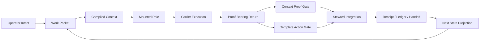

# ION

**A continuity substrate for AI work.**

---

Most AI sessions are sophisticated amnesia.

A model produces something useful. You close the tab. The next session starts
from nothing: no memory of what was decided, no record of what changed, no way
for a fresh agent to know what the last one knew. You reconstruct. You
re-explain. You lose ground.

ION is built on a different premise: continuity is an engineering problem, not
a model capability problem. It does not wait for models to remember. It governs
the work so that any capable model can pick up where the last one stopped.

---

## The Central Question

```text
What is an AI output allowed to change?
```

ION answers by putting every meaningful act through a single controlled path:

```text
intent -> packet -> context -> role -> execution -> proof -> gate -> receipt -> next state
```

Output is not truth. Output is a proposal. A proposal earns the right to become
state by passing context proof, template action proof, and Steward integration.
If a result cannot show its packet, its context, its authority path, and its
receipt, it is not yet ION state.

This is not bureaucracy. It is the difference between a system that continues
and a system that restarts.

---

## How It Works

ION is a hybrid runtime: part Python kernel, part governance protocol, part
context engine.

A **work packet** carries the bounded intent for a task: what is being
attempted, under which authority, with which constraints. A **context package**
compiles exactly the material the role needs for that step, ranked and bounded,
rather than relying on a model's ambient recall. A **mounted role** - STEWARD,
MASON, VIZIER, NEMESIS, and others - executes a bounded function inside ION's
authority model. A **carrier** is the machine carrying the role: ChatGPT
Browser, Cursor IDE, Codex CLI, MCP, or future adapters. Roles and carriers are
not the same thing.

```text
ION governs.
Carriers carry.
Roles execute bounded functions.
No carrier becomes ION identity.
```

Returns come back as proposals. Proof gates evaluate them. Steward integration
accepts or rejects them. Receipts land. The next state is explicit,
inspectable, and inheritable.



---

## What It Solves

| Problem | ION answer |
| --- | --- |
| Context loss | Compile bounded context packages. Do not rely on informal memory. |
| Role confusion | Separate roles from carriers. Bind work to mounted authority. |
| Output laundering | Raw returns are proposals until proof gates and Steward integration accept them. |
| Unbounded automation | Automation is subordinate to explicit policies, approvals, and receipts. |
| Continuity drift | State survives through packets, ledgers, receipts, audits, and visible projections. |

---

## Roles And Carriers

ION defines roles as bounded functions, not as the machines that run them. The
same role may be carried by different models across different sessions. What
persists is the mounted authority and the compiled context, not the model's
memory.

**Core roles:**

| Role | Function |
| --- | --- |
| `STEWARD` | Integration, routing, acceptance, rejection, closure. |
| `RELAY` | Intake, packet formation, transmission, handoff. |
| `VIZIER` | Strategy, route intelligence, high-level planning. |
| `MASON` | Build coordination and implementation work. |
| `NEMESIS` | Adversarial audit and failure-mode attack. |
| `VESTIGE` | Memory, archaeology, residue interpretation. |
| `SCRIBE` | Structured capture and documentation. |
| `VICE` | Discipline, critique, hardening pressure. |

**Current carriers:**

| Carrier | Role in the system |
| --- | --- |
| ChatGPT Browser | Conversation, continuity, coordination. |
| Cursor IDE | Local IDE carrier with file visibility. |
| Codex CLI | Bounded local filesystem, build, and test worker. |
| MCP | Tool transport and capability exposure. |

---

## The Kernel

The executable kernel lives at:

```text
ION/04_packages/kernel/
```

Its job is to make state, authority, and transitions inspectable, not to sound
intelligent.

Key surfaces:

- `ion_status.py` - ground truth for current system state
- `ion_carrier_onboard.py` - lawful carrier mount entry
- `ion_carrier_continue.py` - continuation from prior receipt
- `ion_cycle_runner.py` - bounded work cycle execution
- `ion_context_proof_gate.py` - context verification membrane
- `ion_template_action_gate.py` - template compliance verification
- `ion_steward_integrate.py` - integration control surface
- `ion_agent_invocation_broker.py` - governed agent dispatch
- `ion_codex_queue_runner.py` - Codex CLI work queue management
- `ion_cockpit_view_model.py` - operator-facing state projection

**Fast verification:**

```bash
# Install
python3 -m venv .venv
source .venv/bin/activate
pip install -e .

# Current state
python3 -m kernel.ion_status --ion-root . --json

# Full test suite
PYTHONDONTWRITEBYTECODE=1 PYTHONPATH=ION/04_packages python3 -m pytest ION/tests -q
```

---

## Repository Shape

ION is large because it is not only code. It contains doctrine, protocols,
registries, templates, runtime state, receipts, UI, and integrations.

| Path | Purpose |
| --- | --- |
| `ION/01_doctrine/` | Constitutional law. What must remain true. |
| `ION/02_architecture/` | How the system works. Protocols and lifecycle rules. |
| `ION/03_registry/` | Entities, carrier profiles, schemas, policies. |
| `ION/04_packages/kernel/` | What actually runs. |
| `ION/05_context/` | Active state, history, receipts, handoffs. |
| `ION/06_intelligence/` | Audits, research, orchestration artifacts. |
| `ION/07_templates/` | The shape work must take. |
| `ION/08_ui/` | Operator cockpit surfaces. |
| `ION/09_integrations/` | Browser extension, Cursor, daemon, MCP, ChatGPT connector. |

Root-level witness files from earlier consolidation passes are archived under:

```text
ION/05_context/archive/root_witness_manifests/
```

---

## Mounting A Carrier

Fresh entry rule: **do not begin by guessing.**

Read in order before acting:

1. `ION/REPO_AUTHORITY.md`
2. `ION/02_architecture/ION_MOUNT_CONTRACT.md`
3. `ION/docs/setup/ION_CURRENT_OPERATING_PACKET_V119.md`
4. The selected carrier profile under `ION/03_registry/`
5. The selected carrier execution packet under `ION/07_templates/carriers/`
6. The active packet or context package under `ION/05_context/current/`

A carrier is not trusted because it announces itself. It is trusted when the
mount path, context, template, return contract, and proof path are in force.

---

## Design Laws

These are not principles. They are anti-failure constraints discovered under
pressure.

**Manual operation is real operation.** Manual mode is not a degraded fallback.
It is the lawful baseline that keeps the system honest when carriers are weak.

**Automation is shadow until proven.** A daemon or connector has no authority
because it can execute. It earns authority through bounded, audited, approved,
receipted operation.

**Output is proposal until accepted.** Worker output can be correct, even
brilliant. It does not become ION state until the appropriate proof and
integration path accepts it.

**No silent loss.** State-bearing artifacts do not disappear for convenience.
Obsolete surfaces require custody: containment, archive, supersession, or
explicit revocation.

**One workflow.** Manual execution, IDE-native execution, daemon-assisted
execution, and swarm execution are all carriers of the same canonical loop.
They are not different systems.

**Context packages over vague memory.** ION does not rely on a carrier knowing
what you mean. It compiles and proves the context the step requires.

**Projection discipline.** Status surfaces describe actual authority. A cockpit
that hides limits is worse than no cockpit.

---

## Integrations

**ChatGPT Browser** connects through a bounded MCP connector contract at
`ION/09_integrations/mcp/chatgpt_connector/`. The connector exposes a governed
tool surface, not unconstrained shell access wrapped in protocol.

**Codex CLI** operates as a bounded local worker through a governed queue. Work
packets go in. Proof-gated receipts come out. Raw Codex output does not become
ION state directly.

**Browser ChatOps extension** detects valid `ion_action` YAML blocks in ChatGPT
Browser, validates them through a local daemon, presents approval controls, and
converts approved actions into ION artifacts and receipts.

**Cursor IDE** provides file visibility and an editor-adjacent carrier lane
under `ION/02_architecture/ION_OVER_CURSOR_PROTOCOL.md`.

**GitHub** is the data plane: collaboration, mirroring, review, release
packaging. It is not the authority of ION. Local law, gates, receipts, and the
custody model hold that authority.

---

## The Cockpit

ION should not be invisible orchestration. If the system claims a state, the
operator must be able to inspect it. If automation claims authority, the
cockpit must show the boundary.

Current JOC cockpit panels under `ION/08_ui/joc_cockpit_shell/`:

- `RuntimeStatusPanel` - current objective, production authority, live execution
  posture
- `CarrierTurnPanel` - active carrier, mounted role, turn state
- `LaneTimelinePanel` - ordered lane progression and history
- `HumanGateQueuePanel` - pending operator decisions
- `TaskReturnLedgerPanel` - accepted and rejected return history
- `StewardIntegrationQueuePanel` - integration decisions in flight
- `ReceiptHydrationPanel` - receipt trail and inheritance chain

---

## What Comes Next

**Browser-first operation.** The ChatOps lane points toward full ION operation
from a browser: approval-gated local effects, package export, queue visibility,
and diagnostics without a local IDE.

**ChatGPT sandbox return lane.** ChatGPT Browser works on a local package in
sandbox, then returns a patch to `ION/05_context/inbox/` for local review and
formal integration. Powerful compute without surrendering proof boundaries.

**Hosted runtime.** A cloud-hosted ION instance can preserve local-first
governance while making the system accessible from any device.

**Swarm control.** The agent invocation broker enables GPT Browser to invoke
named roles - MASON, VIZIER, NEMESIS, STEWARD, and others - as governed
Codex-backed workers. The carrier loop closes from browser to local execution
to receipted return.

---

## Verified State

```text
ion_status verdict:    ION_STATUS_READY
Tests:                 265 passed
Production authority:  false (by design, at this stage)
```

The useful question is never "does this look right?" It is:

```text
What receipt, gate, manifest, or ledger proves the claim?
```

---

## Why This Project Exists

AI work is becoming serious faster than its continuity machinery.

There are many systems that act alive for a few minutes. Fewer that can tell
you exactly what happened, which context was loaded, which role acted, which
proof passed, which authority was withheld, and what the next worker may
inherit.

ION attacks that gap directly.

The shortest true description:

```text
ION is a continuity machine.
It turns AI work from isolated outputs into governed, inspectable, resumable state.
```

A model can answer. ION is built to continue.

---

*Local-first. Proof-gated. Carrier-agnostic.*

