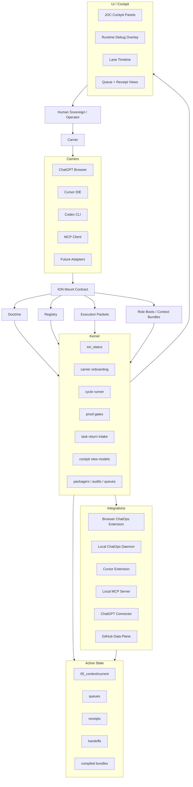
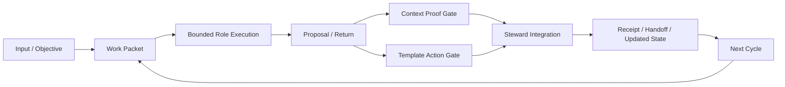

# ION

> **A protocol of continuity for AI work.**  
> Not just an application, not just an agent framework, and not just a set of
> prompts - **ION** is a governed operating substrate for long-horizon AI
> orchestration, context continuity, proof-gated action, and carrier-agnostic
> execution.

---

## Table Of Contents

1. [What ION Is](#what-ion-is)
2. [Why ION Exists](#why-ion-exists)
3. [The Central Thesis](#the-central-thesis)
4. [Current Truthful Posture](#current-truthful-posture)
5. [A Whole-System Map](#a-whole-system-map)
6. [The Canonical Workflow](#the-canonical-workflow)
7. [Roles, Carriers, And Identity Boundaries](#roles-carriers-and-identity-boundaries)
8. [The Repository Atlas](#the-repository-atlas)
9. [The Kernel Surface](#the-kernel-surface)
10. [Context, State, And Continuity](#context-state-and-continuity)
11. [Integrations](#integrations)
12. [The UI / Cockpit Direction](#the-ui--cockpit-direction)
13. [Getting Started](#getting-started)
14. [How To Mount Correctly](#how-to-mount-correctly)
15. [How To Verify Truth](#how-to-verify-truth)
16. [Design Laws And Invariants](#design-laws-and-invariants)
17. [Selected File Index](#selected-file-index)
18. [What ION Is Not](#what-ion-is-not)
19. [Roadmap And Near-Term Frontiers](#roadmap-and-near-term-frontiers)
20. [Why This Project Matters](#why-this-project-matters)

---

## What ION Is

ION is a **local-first, law-governed, packetized AI operating substrate**.

Its purpose is to let complex AI work continue across time, carriers, tools,
and contexts without collapsing into drift, hand-wavy memory, or ungoverned
execution.

At its core, ION treats meaningful work as a governed loop:

- a work packet is opened;
- context is compiled and bounded;
- roles are mounted through carriers;
- outputs are returned as proposals;
- proofs and gates decide whether those outputs may affect state;
- receipts preserve continuity;
- the next cycle begins from preserved truth rather than improvisation.

ION is best understood as a hybrid of:

- an AI runtime kernel;
- an orchestration protocol;
- a context continuity system;
- a receipt and proof membrane;
- a carrier model for IDEs, ChatGPT Browser, Codex CLI, MCP, and future
  adapters;
- and an emerging cockpit UI for observing and steering the system.

It is not built on the assumption that a single model, chat, or context window
can remain authoritative forever. Instead, it encodes the idea that continuity
must be constructed, governed, projected, and renewed.

## Why ION Exists

Modern AI work breaks down in predictable ways:

- context windows overflow;
- tools and chats lose continuity;
- outputs are mistaken for truth;
- hosts confuse carrier behavior with system authority;
- agent systems drift into improvisation;
- automations mutate state without sufficient proof;
- large projects become impossible to steward coherently over time.

ION exists to answer that failure mode.

It is an attempt to turn AI work from an ephemeral conversation into a
**governed operational continuum**.

The project is especially concerned with:

- long-horizon orchestration;
- continuity across sessions and carriers;
- truthful state rather than role-played state;
- manual fallback that is still lawful;
- explicit authority boundaries between thinking, acting, integrating, and
  presenting.

## The Central Thesis

### 1. Continuity Must Be Protocolized

AI continuity should not depend on a model "remembering" in an informal sense.
It should depend on governed packets, context bundles, registries, receipts,
and laws.

### 2. Work Must Be Bounded

Every meaningful step should be representable as a bounded work unit with clear
scope, allowed paths, forbidden paths, validations, and return expectations.

### 3. Carriers Are Not Identities

ChatGPT Browser, Cursor, Codex CLI, MCP, and other hosts are **carriers**. They
are not ION itself. A carrier can mount a role, but it does not become the
ontology or authority of the system.

### 4. Output Is Not Truth By Default

Raw worker output is proposal material until it crosses proof and acceptance
boundaries.

### 5. Manual Operation Is Real Operation

ION rejects the idea that only full automation is legitimate. Manual execution
must remain a lawful fallback so the system stays operable even when hosts or
adapters are weak.

### 6. Automation Is Shadow Until Proven

A claimed automation is not enough. It must be bounded, auditable, and proven
against the same law that governs manual execution.

### 7. No Silent Loss

Authority-bearing state must not simply disappear. Harmful or obsolete surfaces
may move to containment, quarantine, archive, or supersession - but only with
explicit custody, classification, and proof.

## Current Truthful Posture

This README reflects the public collaboration branch represented by PR #1.

### Verified Shell / Root Shape

- **Shell root:** repository root containing `pyproject.toml` and
  `ION/REPO_AUTHORITY.md`
- **Canonical content root:** `ION/`
- **Package root:** `ION/04_packages/kernel/`
- **Test root:** `ION/tests/`

### Latest Verified Runtime Posture

- `ion_status` verdict: **`ION_STATUS_READY`**
- active-state integrity verdict: **`ION_ACTIVE_STATE_INTEGRITY_READY`**
- production authority: **false**
- live execution authority: **false**
- open human gates: **0**
- spawn queue count: **0**

### Latest Verified Validation

From the repository shell root:

```bash
PYTHONDONTWRITEBYTECODE=1 \
PYTHONPATH=ION/04_packages \
PYTEST_DISABLE_PLUGIN_AUTOLOAD=1 \
python3 -m pytest ION/tests -q
```

Observed result in the latest PR validation pass:

```text
265 passed
```

### Important Current Caution

This branch contains working surfaces for MCP, ChatOps, Codex CLI, current-state
packets, GitHub data-plane work, and UI view models. Default authority remains
intentionally bounded. The system does not claim production authority or
unconstrained live execution because code exists.

## A Whole-System Map



### The Continuity Membrane



This is the heart of ION. The point is not merely to "have agents," but to
ensure each cycle can be resumed, audited, integrated, and trusted.

## The Canonical Workflow

ION's workflow law is distributed across several authority files:

- `ION/REPO_AUTHORITY.md`
- `ION/02_architecture/ION_MOUNT_CONTRACT.md`
- `ION/docs/setup/ION_CURRENT_OPERATING_PACKET_V119.md`
- `ION/01_doctrine/CANONICAL_WORKFLOW.md`

The practical loop is:

1. **Enter the correct root.** Confirm the shell root by the presence of
   `pyproject.toml` and `ION/REPO_AUTHORITY.md`.
2. **Mount through law, not vibes.** Read repo authority, mount contract,
   current operating packet, carrier profile, and the relevant execution
   packet.
3. **Run status.** Let the kernel tell you the actual current state.
4. **Frame the work.** Intake and work-cycle framing happen before broad
   execution.
5. **Route deliberately.** Role, carrier, and work packet boundaries decide the
   lawful lane.
6. **Execute bounded work.** A carrier may traverse multiple phases in sequence,
   but role identity remains bounded to the current phase.
7. **Treat outputs as proposals.** Nothing becomes truth merely because a worker
   produced it.
8. **Use proof gates.** Context proof, template action proof, task return
   intake, and other gates govern whether proposals may affect state.
9. **Close with receipts.** Integration or rejection should leave evidence for
   the next cycle.

ION prefers lawful continuation over clever improvisation.

## Roles, Carriers, And Identity Boundaries

One of the most important ideas in ION is the distinction between **role** and
**carrier**.

### Roles

ION's role web includes orchestration, presentation, context, analysis, memory,
and specialized technical functions.

| Role | Function |
| --- | --- |
| **STEWARD** | systems integration, routing, acceptance/rejection, authority closure |
| **RELAY** | intake, packet formation, transmission, final visible handoff |
| **PERSONA_INTERFACE** | front-stage user-facing presentation when explicitly mounted |
| **VIZIER** | high-level strategy and route intelligence |
| **MASON** | construction / implementation / build execution coordination |
| **VICE** | discipline, critique, pressure testing, hardening |
| **NEMESIS** | adversarial audit and failure-mode pressure |
| **VESTIGE** | memory, archaeology, historical continuity, residue interpretation |
| **SCRIBE** | structured capture and documentation support |

### Carriers

Carriers are hosts or execution chassis:

| Carrier | Meaning |
| --- | --- |
| **ChatGPT Browser** | continuity, coordination, conversation, bounded connector lane |
| **Cursor IDE** | local IDE carrier with extension and subagent surfaces |
| **Codex CLI** | bounded local filesystem/build/test worker carrier |
| **MCP** | protocol transport and tool exposure surface |
| **Future adapters** | additional hosts that may mount ION lawfully |

### Non-Negotiable Boundary

```text
ION orchestrates.
Cursor carries.
Codex carries.
ChatGPT Browser carries.
MCP carries.
No carrier is ION identity.
```

This rule is one of the project's central anti-drift protections.

## The Repository Atlas

The project combines doctrine, architecture, registries, runtime state,
templates, UI, integrations, and tests.

### Top-Level Directory Structure

| Path | Purpose |
| --- | --- |
| `.github/` | public issue and pull request templates |
| `.cursor/` | Cursor carrier configuration and rules |
| `.vscode/` | editor launch/settings recommendations |
| `ION/00_BOOTSTRAP/` | bootstrapping and startup surfaces |
| `ION/01_doctrine/` | constitutional and doctrinal law |
| `ION/02_architecture/` | protocols, lifecycle rules, carrier/runtime architecture |
| `ION/03_registry/` | registries, schemas, policies, carrier profiles |
| `ION/04_agents/` | carrier doctrine and related agent surfaces |
| `ION/04_packages/` | executable Python kernel package root |
| `ION/05_context/` | active state, history, inbox, reports, handoffs, archives |
| `ION/06_intelligence/` | audits, archaeology, reports, orchestration research |
| `ION/07_templates/` | templates for action, context, carriers, automation |
| `ION/08_ui/` | cockpit shell and UI surfaces |
| `ION/09_integrations/` | browser extension, Cursor extension, daemon, MCP |
| `ION/docs/` | setup, encyclopedia, consolidation reports |
| `ION/examples/` | examples and helper surfaces |
| `ION/tests/` | kernel and integration test suite |

Historical root witness files such as `FILES_ADDED_V*.txt` and
`FULL_PROJECT_CONSOLIDATION_RECEIPT_*.txt` are archived under:

```text
ION/05_context/archive/root_witness_manifests/
```

### How To Think About These Directories

- `01_doctrine` tells you what must remain true.
- `02_architecture` tells you how the system is supposed to work.
- `03_registry` tells you what entities, policies, and schemas exist.
- `04_packages/kernel` is what actually runs.
- `05_context` is where runtime continuity lives.
- `07_templates` is the governed substrate through which actions and context are
  shaped.
- `08_ui` is the projection surface.
- `09_integrations` is where carriers and adapters meet the kernel.

## The Kernel Surface

The package root is:

```text
ION/04_packages/kernel/
```

This is the executable center of gravity for the current repo.

Representative kernel modules include:

- `ion_status.py`
- `ion_carrier_onboard.py`
- `ion_carrier_continue.py`
- `ion_cycle_runner.py`
- `ion_context_proof_gate.py`
- `ion_template_action_gate.py`
- `ion_carrier_task_return.py`
- `ion_steward_integrate.py`
- `ion_active_state_integrity_audit.py`
- `ion_cockpit_view_model.py`
- `ion_codex_queue_runner.py`
- `ion_agent_invocation_broker.py`
- `ion_chatops_bridge.py`
- `ion_github_data_plane_audit.py`
- `ion_lifecycle_packager.py`
- `ion_safe_full_project_packager.py`

Conceptually, the kernel does four things:

1. **Projects state truthfully** - status, view models, audits, packets, queues.
2. **Runs bounded work cycles** - onboarding, continuation, routing, packet
   processing, queue handling.
3. **Protects the membrane** - proof gates, task return intake, authority
   checks, trunk preservation, containment logic.
4. **Bridges to carriers and tools** - MCP, ChatOps, Cursor, Codex, packaging,
   diagnostics.

## Context, State, And Continuity

ION treats context as a structured system, not a loose chat log.

The hot operational center is:

```text
ION/05_context/current/
```

Representative active surfaces include:

- `ACTIVE_WORK_PACKET.json`
- `ACTIVE_ROLE_SPAWN_PLAN.json`
- `ACTIVE_CARRIER_TURN_PACKET.json`
- `ACTIVE_OPERATOR_MESSAGE_QUEUE.json`
- `ACTIVE_HUMAN_GATE_QUEUE.json`
- `ACTIVE_CARRIER_TASK_RETURN_LEDGER.json`
- `ACTIVE_STEWARD_INTEGRATION_QUEUE.json`
- `ACTIVE_COCKPIT_VIEW_MODEL.json`

Around the current-state root, ION maintains additional context planes:

- `archive/`
- `history/`
- `handoff/`
- `runtime_reports/`
- `signals/`
- `steward_handoffs/`
- `inbox/`
- `continuation_bundles/`

The project stance is that context should remain navigable, history should
remain recoverable, generated or superseded surfaces should be contained rather
than silently erased, and no single context artifact should be confused with the
whole system.

## Integrations

ION is increasingly a multi-carrier system.

### MCP

Relevant surfaces:

- `ION/09_integrations/mcp/`
- `ION/04_packages/kernel/ion_mcp_local_bridge.py`
- `ION/04_packages/kernel/ion_mcp_bridge_audit.py`
- `ION/03_registry/ion_mcp_*`

The local MCP lane exposes bounded ION tools rather than arbitrary shell or
filesystem power.

### ChatGPT Browser Connector Lane

Relevant surfaces:

- `ION/docs/setup/CHATGPT_BROWSER_MCP_CONNECTOR_SETUP_V120.md`
- `ION/04_packages/kernel/ion_chatgpt_browser_mcp_connector_contract.py`
- `ION/09_integrations/mcp/chatgpt_connector/`

This bridge lets ChatGPT Browser operate as a continuity and coordination lane
while remaining bounded.

### Browser ChatOps Extension + Local Daemon

Relevant surfaces:

- `ION/09_integrations/browser_extension/ion_chatops_bridge/`
- `ION/09_integrations/local_daemon/ion_chatops_bridge/`
- `ION/04_packages/kernel/ion_chatops_bridge.py`
- `ION/02_architecture/ION_BROWSER_CARRIER_RUNTIME_PROTOCOL.md`
- `ION/02_architecture/ION_CHATOPS_YAML_ACTION_PROTOCOL.md`

The extension detects valid `ion_action` YAML blocks rendered in ChatGPT
Browser, validates them through a localhost daemon, presents approval controls,
and turns approved actions into ION-side artifacts, receipts, work packets, or
package exports.

### Cursor Extension

Relevant surfaces:

- `ION/09_integrations/cursor_extension/`
- `ION/02_architecture/ION_OVER_CURSOR_PROTOCOL.md`

The Cursor lane gives ION a local IDE carrier with file visibility, subagent
slots, and a path toward integrated development workflows.

### Codex CLI

Relevant surfaces:

- `ION/02_architecture/CODEX_CLI_CARRIER_PROTOCOL.md`
- `ION/03_registry/codex_cli_carrier_profile.yaml`
- `ION/07_templates/carriers/CODEX_CLI_EXECUTION_PACKET.md`
- `ION/docs/setup/CODEX_CLI_ION_DOGFOOD_SETUP_V125.md`
- `ION/04_packages/kernel/ion_codex_cli_carrier_audit.py`

Codex CLI is positioned as the preferred local bounded worker carrier for
build/test/diff work.

### GitHub Data Plane

Relevant surfaces:

- `ION/02_architecture/ION_GITHUB_DATA_PLANE_PROTOCOL.md`
- `ION/02_architecture/ION_GITHUB_WORK_DAEMON_PROTOCOL.md`
- `ION/04_packages/kernel/ion_github_data_plane_audit.py`
- `ION/03_registry/ion_github_data_plane_registry.yaml`

GitHub is not the authority of ION. It is the public collaboration and versioning
data plane. Local ION law remains the authority membrane.

## The UI / Cockpit Direction

ION is not only trying to behave correctly. It is trying to **show its own
truth**.

Existing JOC cockpit shell surfaces under `ION/08_ui/joc_cockpit_shell/`
include:

- `RuntimeStatusPanel.tsx`
- `CarrierTurnPanel.tsx`
- `ContextPackageInspectorPanel.tsx`
- `LaneTimelinePanel.tsx`
- `HumanGateQueuePanel.tsx`
- `TaskReturnLedgerPanel.tsx`
- `StewardIntegrationQueuePanel.tsx`
- `ReceiptHydrationPanel.tsx`
- `RuntimeDebugOverlayPanel.tsx`

The cockpit is meant to expose current objective, lane state, queue state, role
progression, gates and blockers, receipts, integration decisions, runtime
overlays, and the true flow of work through the system.

## Getting Started

### Requirements

- Python 3.11+
- a local shell environment
- optional IDE/carrier integrations depending on lane

### Install / Run The Package

From the repository shell root:

```bash
python3 -m venv .venv
source .venv/bin/activate
pip install -e .
```

After editable install, the intended package behavior is:

- `import kernel` works without manual `PYTHONPATH`;
- `python -m kernel` works;
- pytest runs from the shell root against `ION/tests`.

### Fast Verification

```bash
python3 -m kernel.ion_status --ion-root . --json
python3 -m pytest ION/tests -q
```

### Without Editable Install

```bash
PYTHONDONTWRITEBYTECODE=1 PYTHONPATH=ION/04_packages python3 -S -m kernel.ion_status --ion-root . --json
```

## How To Mount Correctly

If you enter the repo fresh, do not begin by guessing.

Read in this order:

1. `ION/REPO_AUTHORITY.md`
2. `ION/02_architecture/ION_MOUNT_CONTRACT.md`
3. `ION/docs/setup/ION_CURRENT_OPERATING_PACKET_V119.md`
4. the selected carrier profile under `ION/03_registry/`
5. the selected carrier execution packet template under
   `ION/07_templates/carriers/`
6. the active packet or spawn-row context package under
   `ION/05_context/current/`
7. `ION/01_doctrine/CANONICAL_WORKFLOW.md` when broad workflow doctrine is
   needed

That is the repo's own stated mount order.

Example status and continuation trace:

```bash
PYTHONDONTWRITEBYTECODE=1 PYTHONPATH=ION/04_packages python3 -S -m kernel.ion_status --ion-root . --json
PYTHONDONTWRITEBYTECODE=1 PYTHONPATH=ION/04_packages python3 -S -m kernel.ion_carrier_continue --ion-root . --carrier CHATGPT_BROWSER_CARRIER --operator-message "continue" --json
```

## How To Verify Truth

The most important habit in ION is to distinguish between **described state**
and **observed state**.

Useful verification commands:

```bash
python3 -m kernel.ion_status --ion-root . --json
python3 -m kernel.ion_carrier_onboarding_authority_audit --ion-root . --json
python3 -m kernel.ion_mcp_bridge_audit --ion-root . --json
python3 -m kernel.ion_codex_cli_carrier_audit --ion-root . --json
python3 -m kernel.ion_github_data_plane_audit --ion-root . --json
python3 -m pytest ION/tests -q
```

The project strongly prefers auditable proof over chat claims.

## Design Laws And Invariants

### Manual ION Is Real

Manual mode is the lawful fallback that keeps the system usable when higher
automation levels are unavailable.

### Automation Is Shadow Until Proven

No carrier, adapter, or daemon should claim more power or correctness than has
actually been demonstrated.

### No Silent Loss + Containment Preservation

A file or authority surface should not vanish unreceipted. The right answer to
stale or conflicting state is custody and classification.

### One Canonical Workflow

Multiple carriers may exist, but they should converge on one law-governed
operational loop rather than inventing contradictory execution stories.

### Bounded Work And Bounded Identity

Roles, phases, allowed paths, and validations are meant to stay explicit.

### Context Packages Over Vague Memory

Structured context artifacts outrank loose implied memory.

### Projection Discipline

UI, status, and reporting surfaces should project truth rather than improvise
it.

## Selected File Index

### Core Authority

- `ION/REPO_AUTHORITY.md`
- `ION/02_architecture/ION_MOUNT_CONTRACT.md`
- `ION/docs/setup/ION_CURRENT_OPERATING_PACKET_V119.md`
- `ION/01_doctrine/CANONICAL_WORKFLOW.md`
- `ION/01_doctrine/SOVEREIGN_CONSTITUTION.md`
- `ION/01_doctrine/SOVEREIGN_KERNEL.md`

### Carrier And Runtime Architecture

- `ION/02_architecture/CODEX_CLI_CARRIER_PROTOCOL.md`
- `ION/02_architecture/ION_BROWSER_CARRIER_RUNTIME_PROTOCOL.md`
- `ION/02_architecture/ION_CHATOPS_YAML_ACTION_PROTOCOL.md`
- `ION/02_architecture/ION_OVER_CURSOR_PROTOCOL.md`

### Registry / Profile Surfaces

- `ION/03_registry/chatgpt_browser_carrier_profile.yaml`
- `ION/03_registry/codex_cli_carrier_profile.yaml`
- `ION/03_registry/mcp_full_carrier_tool_registry.yaml`
- `ION/03_registry/ion_chatops_action.schema.yaml`
- `ION/03_registry/ion_chatops_extension_policy.yaml`
- `ION/03_registry/ion_chatops_local_daemon_policy.yaml`

### Executable Kernel Surfaces

- `ION/04_packages/kernel/ion_status.py`
- `ION/04_packages/kernel/ion_carrier_onboard.py`
- `ION/04_packages/kernel/ion_carrier_continue.py`
- `ION/04_packages/kernel/ion_cycle_runner.py`
- `ION/04_packages/kernel/ion_chatops_bridge.py`
- `ION/04_packages/kernel/ion_codex_queue_runner.py`
- `ION/04_packages/kernel/ion_agent_invocation_broker.py`
- `ION/04_packages/kernel/ion_cockpit_view_model.py`
- `ION/04_packages/kernel/ion_github_data_plane_audit.py`

### Integrations

- `ION/09_integrations/browser_extension/ion_chatops_bridge/README.md`
- `ION/09_integrations/local_daemon/ion_chatops_bridge/README.md`
- `ION/09_integrations/mcp/chatgpt_connector/README.md`
- `ION/09_integrations/cursor_extension/README.md`

### UI And Cockpit

- `ION/08_ui/joc_cockpit_shell/JocCockpitShell.tsx`
- `ION/08_ui/joc_cockpit_shell/RuntimeStatusPanel.tsx`
- `ION/08_ui/joc_cockpit_shell/LaneTimelinePanel.tsx`
- `ION/08_ui/joc_cockpit_shell/ReceiptHydrationPanel.tsx`

### Living Project Documentation

- `ION/docs/encyclopedia/ION_Production_Encyclopedia_v4_0_LIVE_V96_V100_CONTEXT_SYSTEM_AND_AUTONOMOUS_LOOP_RECOVERY.md`
- `ION/docs/consolidation/ION_V119_CURRENT_OPERATING_PACKET_REPORT_20260503.md`
- `ION/docs/consolidation/ION_V120_CHATGPT_BROWSER_MCP_CONNECTOR_AND_LOCAL_ION_OPERATION_REPORT_20260503.md`
- `ION/docs/consolidation/ION_V125_CODEX_CLI_CARRIER_AND_CHATGPT_CONNECTOR_DOGFOOD_REPORT_20260504.md`

## What ION Is Not

ION is **not**:

- a generic "agent swarm" with hand-wavy autonomy claims;
- a simple memory layer pasted onto a chatbot;
- a single UI pretending to be the system;
- a replacement for git, tests, or local development discipline;
- a justification for unconstrained automation;
- a prompt trick dressed up as infrastructure.

It is trying to be something harder: a coherent, inspectable, protocolized
operating substrate for AI work.

## Roadmap And Near-Term Frontiers

### 1. Browser-Side ION Operation

The ChatOps extension and daemon suggest a future where ChatGPT Browser can
operate as a genuine carrier lane with approval-gated local effects, package
export, queue visibility, and sandbox return intake.

### 2. Stronger Cockpit UI

The JOC cockpit can evolve into the primary truth surface for active objective,
lane state, queue progression, approvals, receipts, and continuity review.

### 3. ChatGPT Sandbox Return Lane

A promising direction is the ability for ChatGPT Browser to work on a local ZIP
or package in its sandbox, then return a patch or artifact to
`ION/05_context/inbox/` for formal local review and integration.

### 4. GitHub Data Plane Maturation

GitHub can support public/private collaboration, issue planning, PR review,
release packaging, and citation-backed code analysis while local ION law remains
the authority membrane.

### 5. Visual And Browser Execution Agents

The registry and architecture show interest in local visual harnesses, browser
execution harnesses, and richer automated perception/verification surfaces.

### 6. Hosted / HTTP MCP Evolution

The repo contains hosted MCP alpha work, including transport preview, auth,
OAuth/HTTP preview, storage receipt ledgers, and replay.

## Why This Project Matters

Most AI systems today are either too weakly structured to preserve truth or too
rigidly productized to allow real ontological growth.

ION attempts a rarer path. It aims to preserve:

- continuity without illusion;
- autonomy without lawlessness;
- modularity without fragmentation;
- orchestration without role confusion;
- evolution without silent drift.

That makes it more than a repo. It is a sustained attempt to answer a hard
question:

**What would an actually serious operating substrate for AI continuity look like
if it were built from first principles, under law, and in public technical
form?**

ION is one answer.

## Final Note

This repository is best approached as a living kernelized branch rather than a
finished product brochure.

It contains doctrine, law, runtime code, context systems, UI projections,
carrier adapters, audits, and living receipts - all in active dialogue with one
another.

If you want the shortest truthful summary, it is this:

> **ION is a continuity machine.**  
> It turns AI work from isolated outputs into a governed, inspectable, resumable
> operational continuum.

