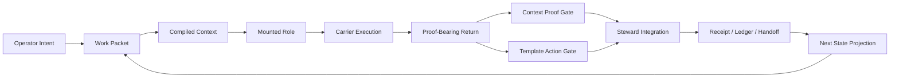

# ION

**A continuity substrate for AI work.**

*Local-first. Proof-gated. Carrier-agnostic.*

---

Most AI sessions are sophisticated amnesia.

A model produces something useful. You close the tab. The next session starts
from nothing: no durable record of what was decided, no proof of what changed,
no reliable way for a fresh agent to know what the last one knew. You
reconstruct. You re-explain. You lose ground.

ION is built on a different premise:

```text
Continuity is an engineering problem, not a model-memory feature.
```

ION does not wait for a model to remember. It governs the work so any capable
carrier can resume from explicit state, bounded context, accepted receipts, and
inspectable authority.

---

## The Central Question

```text
What is an AI output allowed to change?
```

ION answers by putting meaningful work through a controlled path:

```text
intent -> packet -> context -> role -> execution -> proof -> gate -> receipt -> next state
```

Output is not truth. Output is a proposal.

A proposal earns the right to become state by passing context proof, template
action proof, and Steward integration. If a result cannot show its packet,
context, authority path, and receipt, it is not yet ION state.

This is not bureaucracy. It is the difference between a system that continues
and a system that merely restarts with better notes.

---

## How It Works

ION is a hybrid runtime: part Python kernel, part governance protocol, part
context engine.

A **work packet** carries bounded task intent: what is being attempted, under
which authority, against which constraints.

A **context package** compiles the material a role needs for a step. It is
ranked, bounded, and explicit. It is not a model's ambient recall.

A **mounted role** executes a bounded function inside ION's authority model.
Roles include `STEWARD`, `MASON`, `VIZIER`, `NEMESIS`, `VESTIGE`, `SCRIBE`, and
others.

A **carrier** is the machine carrying the role: ChatGPT Browser, Cursor IDE,
Codex CLI, MCP, or a future adapter.

Roles and carriers are not the same thing.

```text
ION governs.
Carriers carry.
Roles execute bounded functions.
No carrier becomes ION identity.
```

Returns come back as proposals. Proof gates evaluate them. Steward integrates
or rejects them. Receipts land. The next state becomes explicit, inspectable,
and inheritable.



---

## What It Solves

| Problem | ION answer |
| --- | --- |
| Context loss | Compile bounded context packages. Do not rely on informal memory. |
| Role confusion | Separate roles from carriers. Bind work to mounted authority. |
| Output laundering | Treat raw returns as proposals until proof gates and Steward integration accept them. |
| Unbounded automation | Keep automation subordinate to explicit policies, approvals, and receipts. |
| Continuity drift | Preserve state through packets, ledgers, receipts, audits, and visible projections. |

---

## Roles And Carriers

ION defines roles as bounded functions, not as the machines that run them. The
same role may be carried by different models across different sessions. What
persists is mounted authority, compiled context, and accepted state - not the
model's private memory.

### Core Roles

| Role | Function |
| --- | --- |
| `STEWARD` | Integration, routing, acceptance, rejection, closure. |
| `RELAY` | Intake, packet formation, transmission, handoff. |
| `VIZIER` | Strategy, route intelligence, high-level planning. |
| `MASON` | Build coordination and implementation work. |
| `NEMESIS` | Adversarial audit and failure-mode attack. |
| `VESTIGE` | Memory, archaeology, residue interpretation. |
| `SCRIBE` | Structured capture and documentation. |
| `VICE` | Discipline, critique, hardening pressure. |

### Current Carriers

| Carrier | Role in the system |
| --- | --- |
| ChatGPT Browser | Conversation, continuity, coordination. |
| Cursor IDE | Local IDE carrier with file visibility. |
| Codex CLI | Bounded local filesystem, build, and test worker. |
| MCP | Tool transport and capability exposure. |

---

## The Kernel

The executable kernel lives at:

```text
ION/04_packages/kernel/
```

Its job is to make state, authority, and transitions inspectable. It is not
there to sound intelligent.

Key surfaces:

- `ion_status.py` - current system state
- `ion_carrier_onboard.py` - lawful carrier mount entry
- `ion_carrier_continue.py` - continuation from prior receipts
- `ion_cycle_runner.py` - bounded work-cycle execution
- `ion_context_proof_gate.py` - context verification membrane
- `ion_template_action_gate.py` - template compliance verification
- `ion_steward_integrate.py` - integration control surface
- `ion_agent_invocation_broker.py` - governed agent dispatch
- `ion_codex_queue_runner.py` - Codex CLI work queue management
- `ion_cockpit_view_model.py` - operator-facing state projection

### Fast Verification

```bash
# Install
python3 -m venv .venv && source .venv/bin/activate && pip install -e .

# Current state
python3 -m kernel.ion_status --ion-root . --json

# Full test suite
PYTHONDONTWRITEBYTECODE=1 PYTHONPATH=ION/04_packages python3 -m pytest ION/tests -q
```

---

## Repository Shape

ION is large because it is not only code. It contains doctrine, protocols,
registries, templates, runtime state, receipts, UI, integrations, and audits.

| Path | Purpose |
| --- | --- |
| `ION/01_doctrine/` | Constitutional law. What must remain true. |
| `ION/02_architecture/` | Protocols, lifecycle rules, and runtime architecture. |
| `ION/03_registry/` | Entities, carrier profiles, schemas, and policies. |
| `ION/04_packages/kernel/` | Executable kernel. What actually runs. |
| `ION/05_context/` | Active state, history, receipts, and handoffs. |
| `ION/06_intelligence/` | Audits, research, and orchestration artifacts. |
| `ION/07_templates/` | The shape work must take. |
| `ION/08_ui/` | Operator cockpit surfaces. |
| `ION/09_integrations/` | Browser extension, Cursor, daemon, MCP, and ChatGPT connector lanes. |

Root-level witness files from earlier consolidation passes are archived under:

```text
ION/05_context/archive/root_witness_manifests/
```

---

## Full Encyclopedia

The long-form system reference is the living encyclopedia:

[ION Production Encyclopedia v4.0](ION/docs/encyclopedia/ION_Production_Encyclopedia_v4_0_LIVE_V96_V100_CONTEXT_SYSTEM_AND_AUTONOMOUS_LOOP_RECOVERY.md)

Use it when you need broader history, context-system background, recovery
lineage, and the larger system map. It is not a production ratification and it
does not outrank current startup authority. For active work, mount through
`ION/REPO_AUTHORITY.md`, `ION/02_architecture/ION_MOUNT_CONTRACT.md`, current
packets, registries, templates, and receipts.

---

## Mounting A Carrier

Fresh entry rule:

```text
Do not begin by guessing.
```

Read in order before acting:

1. `ION/REPO_AUTHORITY.md`
2. `ION/02_architecture/ION_MOUNT_CONTRACT.md`
3. `ION/docs/setup/ION_CURRENT_OPERATING_PACKET_V119.md`
4. the selected carrier profile under `ION/03_registry/`
5. the selected carrier execution packet under `ION/07_templates/carriers/`
6. the active packet or context package under `ION/05_context/current/`

A carrier is not trusted because it announces itself. It is trusted when the
mount path, context, template, return contract, and proof path are in force.

---

## Design Laws

These are not slogans. They are anti-failure constraints discovered under
pressure.

**Manual operation is real operation.** Manual mode is not a degraded fallback.
It is the lawful baseline that keeps the system honest when carriers are weak.

**Automation is shadow until proven.** A daemon or connector has no authority
because it can execute. It earns authority through bounded, audited, approved,
receipted operation.

**Output is proposal until accepted.** Worker output can be correct, even
brilliant. It does not become ION state until the appropriate proof and
integration path accepts it.

**No silent loss.** State-bearing artifacts do not disappear for convenience.
Obsolete surfaces require custody: containment, archive, supersession, or
explicit revocation.

**One workflow.** Manual execution, IDE-native execution, daemon-assisted
execution, and swarm execution are carriers of the same canonical loop. They
are not different systems.

**Context packages over vague memory.** ION does not rely on a carrier knowing
what the operator means. It compiles and proves the context the step requires.

**Projection discipline.** Status surfaces describe actual authority. A cockpit
that hides limits is worse than no cockpit.

---

## Integrations

**ChatGPT Browser** connects through a bounded MCP connector contract at
`ION/09_integrations/mcp/chatgpt_connector/`. The connector exposes a governed
tool surface, not unconstrained shell access wrapped in protocol.

**Codex CLI** operates as a bounded local worker through a governed queue. Work
packets go in. Proof-gated receipts come out. Raw Codex output does not become
ION state directly.

**Browser ChatOps extension** detects valid `ion_action` YAML blocks in ChatGPT
Browser, validates them through a local daemon, presents approval controls, and
converts approved actions into ION artifacts and receipts.

**Cursor IDE** provides file visibility and an editor-adjacent carrier lane
under `ION/02_architecture/ION_OVER_CURSOR_PROTOCOL.md`.

**GitHub** is the data plane: collaboration, mirroring, review, release
packaging. It is not the authority of ION. Local law, gates, receipts, and
custody hold authority.

---

## The Cockpit

ION should not be invisible orchestration.

If the system claims state, the operator must be able to inspect it. If
automation claims authority, the cockpit must show the boundary.

Current JOC cockpit panels under `ION/08_ui/joc_cockpit_shell/`:

- `RuntimeStatusPanel` - current objective, production authority, live execution
  posture
- `CarrierTurnPanel` - active carrier, mounted role, turn state
- `LaneTimelinePanel` - ordered lane progression and history
- `HumanGateQueuePanel` - pending operator decisions
- `TaskReturnLedgerPanel` - accepted and rejected return history
- `StewardIntegrationQueuePanel` - integration decisions in flight
- `ReceiptHydrationPanel` - receipt trail and inheritance chain

---

## What Comes Next

**Browser-first operation.** The ChatOps lane points toward full ION operation
from a browser: approval-gated local effects, package export, queue visibility,
and diagnostics without a local IDE.

**ChatGPT sandbox return lane.** ChatGPT Browser works on a local package in
sandbox, then returns a patch to `ION/05_context/inbox/` for local review and
formal integration. Powerful compute without surrendering proof boundaries.

**Hosted runtime.** A cloud-hosted ION instance that preserves local-first
governance while making the system reachable from any device.

**Swarm control.** The agent invocation broker enables GPT Browser to invoke
named roles - `MASON`, `VIZIER`, `NEMESIS`, `STEWARD`, and others - as governed
Codex-backed workers. The carrier loop closes from browser to local execution
to receipted return.

---

## Verified State

```text
ion_status verdict:    ION_STATUS_READY
Tests:                 265 passed
Production authority:  false
```

Production authority is withheld by design at this stage.

The useful question is never:

```text
Does this look right?
```

It is:

```text
What receipt, gate, manifest, or ledger proves the claim?
```

---

## Why This Project Exists

AI work is becoming serious faster than its continuity machinery.

There are many systems that act alive for a few minutes. There are fewer
systems that can tell you exactly what happened, which context was loaded,
which role acted, which proof passed, which authority was withheld, and what
the next worker may inherit.

ION attacks that gap directly.

```text
ION is a continuity machine.
It turns AI work from isolated outputs into governed, inspectable, resumable state.
```

A model can answer.

ION is built to continue.

